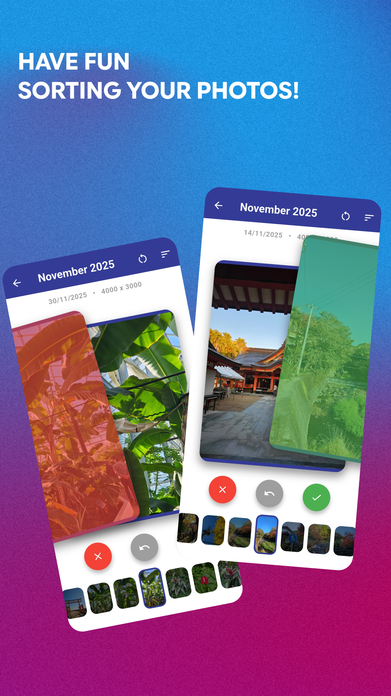
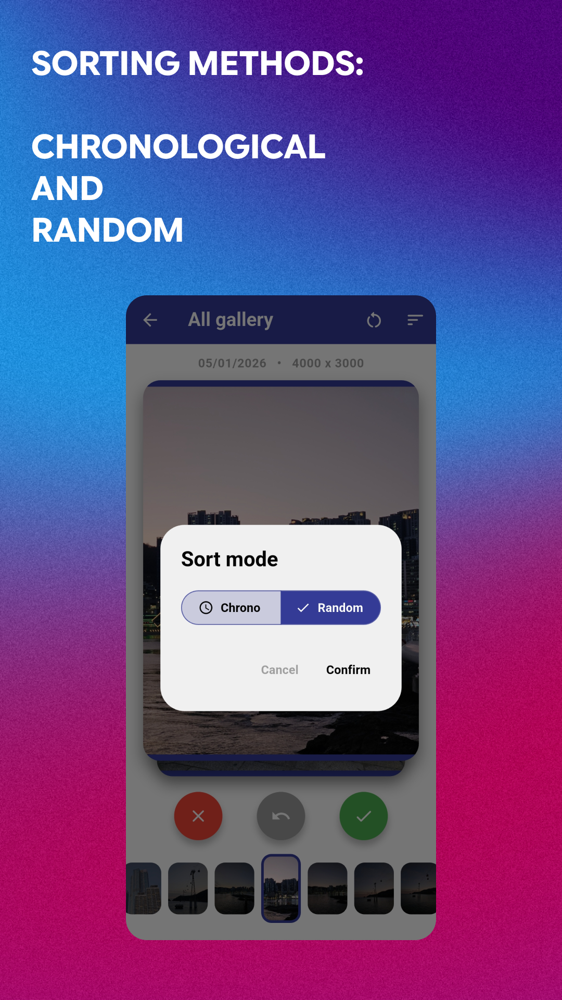
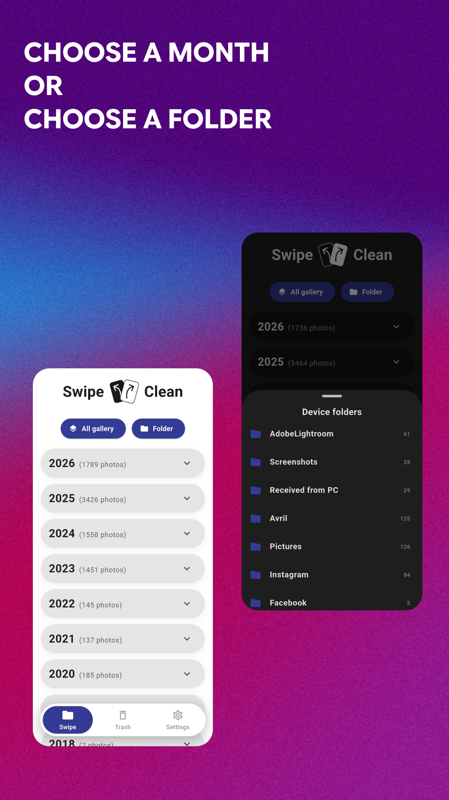
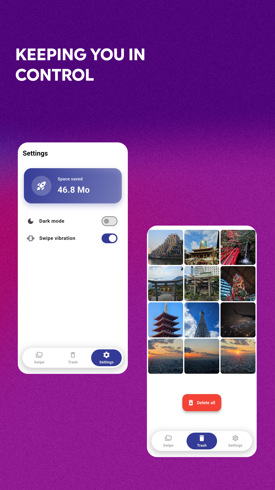

# Swipe Clean

## The problem solved

Smartphone galleries accumulate thousands of photos. This makes sorting tedious and fills up storage space quickly. Native applications often struggle to process large volumes of images or crash when dealing with hybrid systems like HyperOS that mix local files and cloud thumbnails.

Swipe Clean makes cleaning your gallery easy. The app scans local storage, ignores ghost or corrupted files, and groups images by year and month. The user then sorts their photos using a fluid swiping interface, sends unwanted items to an internal trash bin, and can see the total storage space freed up.

## Screenshots

 

## Technical architecture

The application is built with the Flutter framework and the Dart programming language. The architecture focuses heavily on performance and safe Android native calls.

* **Native storage reading :** Integrates `photo_manager`. The query uses a strict `SizeConstraint` to exclude files without real physical dimensions. This prevents fatal errors caused by cloud thumbnails. It also loads metadata in asynchronous chunks.
* **CPU optimization :** Injects manual pauses (`Future.delayed`) between mathematical calculation batches. This lets the Main Thread breathe and prevents the `Choreographer` from choking when analyzing massive galleries.
* **Data persistence :** Uses `shared_preferences` wrapped in a `StorageService` to instantly memorize the dark mode state, vibration settings, processed photo IDs, and the trash bin content.
* **State management :** Injects a `ValueNotifier` at the root of the widget tree (`main.dart`) to dynamically broadcast theme changes across the entire interface.

## Download

The application is officially available for Android devices.

[Download Swipe Clean on the Google Play Store](https://play.google.com/store/apps/details?id=com.kubbycubs.swipe_clean)

[Download the latest APK on GitHub](https://github.com/nathan-real/Swipe-Clean/releases/tag/0.9.6)
